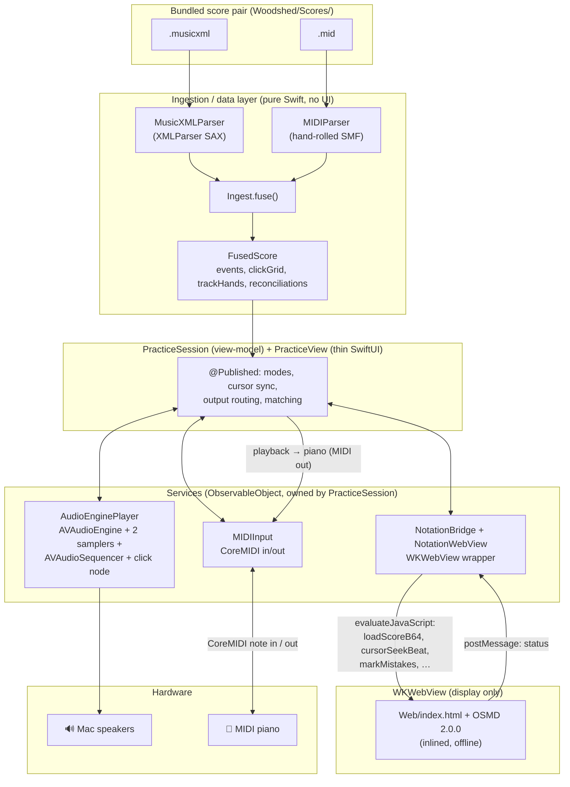

# Architecture — Woodshed

How the app is put together, derived from the current source under `Woodshed/`.

## High-level shape

One SwiftUI multiplatform app. A **pure-Swift ingestion/data layer** turns a MusicXML+MIDI pair into
an authoritative note model; three **ObservableObject services** own audio, MIDI, and the notation
web view; a **`PracticeSession` view-model** (`ObservableObject`) owns the practice state and all
playback/matching logic; and a thin SwiftUI view (`PracticeView`) binds to it for presentation.

## Layers & responsibilities

### 1. Data model (`Model.swift`)
Value types only, no logic beyond small helpers. The vocabulary shared by every layer. See
[DATA_MODEL.md](DATA_MODEL.md). Key output type is **`FusedScore`** (the authoritative model).

### 2. Ingestion (pure Swift, UI-independent, unit-testable)
- **`MIDIParser.swift`** — dependency-free Standard MIDI File parser. **MIDI is the timing source of
  truth**: it resolves the tempo map to seconds and exposes tick-based beats. Produces `MidiScore`.
- **`MusicXMLParser.swift`** — `XMLParser` (SAX) parser. **MusicXML is the identity/notation source**
  (spelling, hand/staff, voice, ties, ornaments, per-measure meter). Produces `MusicXMLScore`.
- **`Ingest.swift`** — `Ingest.fuse(midiData:musicXMLData:)` fuses the two: merges tied notes,
  aligns per hand by musical beat, absorbs ornament realisations, builds the metronome click grid
  and per-hand track mapping, and produces per-hand `Reconciliation`. Returns `FusedScore`.
  The rules here are the app's hard core — see [INGESTION.md](INGESTION.md).

### 3. Services (`ObservableObject`, owned by `PracticeSession`)
- **`AudioEnginePlayer.swift`** — owns one `AVAudioEngine`. Graph: `samplerRH` + `samplerLH`
  (`AVAudioUnitSampler`, one per hand) → `mainMixerNode`; a separate `clickNode`
  (`AVAudioPlayerNode`) → `mainMixerNode` for the metronome. An `AVAudioSequencer` plays the actual
  `.mid`, routing each track to its hand's sampler (`destinationAudioUnit`). Responsibilities:
  play/stop, count-in, **tempo via `sequencer.rate`** (pitch preserved), **per-hand + speaker mute
  via each sampler's `volume`/`overallGain`**, and a three-tier metronome (synced to playback,
  free-running, or count-in) that can also route clicks to the piano via a `pianoClick` callback.
  Publishes `isPlaying`, `isRunning`, `metronomeOn`, `status`.
- **`MIDIInput.swift`** — owns a CoreMIDI client. Input port (modern `MIDIEventList`/UMP) connects
  all sources and auto-reconnects on hot-plug; publishes `activeNotes` (held pitches), `status`,
  `sources`. Output port (`MIDIPacketList`) sends playback notes and metronome clicks (GM percussion
  on ch. 10) to the piano.
- **`NotationWebView.swift`** — `NSViewRepresentable`/`UIViewRepresentable` wrapping `WKWebView`.
  Contains **`NotationBridge`** (`ObservableObject`) which holds a weak reference to the web view and
  drives it directly (bypassing SwiftUI churn) at the ~50 Hz cursor rate. Loads `Web/index.html`
  with the OSMD script inlined.

### 4. Library & practice history (`Song.swift`, `SongLibrary.swift`, `PracticeHistory.swift`, `ContentView.swift`)
- **`Song` / `SongMeta`** — a library song and its Codable metadata, incl. denormalised
  `lastPracticed` / `bestAccuracy` (see DATA_MODEL.md).
- **`SongLibrary`** (`ObservableObject`) — the file-based library under Application Support: scan,
  import (2 files → a per-song folder), delete, update; seeds the bundled fixtures on first launch.
  `recordPass(_:for:)` appends a pass to the song's history and bumps its derived stats in place;
  `resetProgress(for:)` wipes the history file + derived stats.
- **`BarFlag` / `BarFlagStore`** — pure file IO for the per-song `flags.json` (manual revisit notes,
  one per bar). Session-mirrored for the Flags sheet (`BarFlagsView`) + on-score ⚑ markers.
- **`PracticeHistory` / `PracticePass`** — pure file IO: append/load a per-song append-only
  `history.jsonl`, plus `troubleBars` (all-time) and `currentTroubleBars` (**"clear as you improve"**:
  a bar counts only while the most recent pass covering it still missed notes). No UI, no engines —
  trivially testable. The session mirrors history in memory, computes `currentTroubleBars`, and drives
  the score's amber trouble overlay (toggle `showTroubleOnScore`), refreshing after each pass and once
  the notation reports `loaded`.
- **`ContentView`** — app root: a **`NavigationSplitView`** with **`LibraryView`** as the sidebar
  (the song list — add via `.fileImporter`, delete, rename, favourite) and `PracticeView` as the
  detail. Selection is by song **id** (`@State selection: Song.ID?`) so metadata edits don't drop the
  detail; the detail is keyed `.id(song.id)` so switching songs makes a fresh `PracticeSession`.

### 5. Practice UI (`PracticeSession.swift`, `PracticeView.swift`, `PianoKeyboardView.swift`)
- **`PracticeSession(song:)`** (`ObservableObject`) — the practice **view-model**. Owns the three
  services (created here, their changes re-broadcast so the view observes only the session), the
  `FusedScore`, and ~30 `@Published`/private state values. It loads the song's XML+MIDI on appear
  (`Ingest.fuse`), advances the follow-cursor from the audio clock, routes output, and implements
  **Wait mode**, **Tempo/Grade mode** matching, section practice, and review marks. UI-decoupled: it
  imports only `Foundation`/`Combine`, no SwiftUI.
- **`PracticeView(song:library:)`** — a thin SwiftUI view that creates the session as a `@StateObject`
  and binds controls to it. Holds only the 0.02 s cursor `Timer.publish` and the `onChange` wiring
  (feeding MIDI input / play-state changes to the session); the rest is layout. Wires
  `session.onPassRecorded` to `library.recordPass` so finished Grade passes persist.
- **`PracticeProgressView`** — the per-song Progress sheet (More menu). Loads `history.jsonl` on
  demand and renders the accuracy trend, best/last, trouble-spot heatmap (tap to drill a bar via
  `session.focusBar`), and recent-pass log.
- **`PianoKeyboardView.swift`** — a stateless 88-key keyboard view. Colours: green = you playing,
  blue = right-hand score / red = left-hand score, red = "wrong" when `flagWrong` (Wait/Grade).
  Mouse/touch-playable for testing.

### 5. Notation web surface (`Web/index.html` + vendored OSMD)
Display only — "no logic, no clock in the web layer." Renders the MusicXML and moves a cursor on
command. See the JS bridge contract below.

## Data flow (a practice session)

1. `PracticeSession.ingest()` loads the song's `.musicxml` + `.mid`, calls `Ingest.fuse()` → `FusedScore`,
   and hands the raw MusicXML (base64) to the web view for rendering.
2. `FusedScore.events` (`[NoteEvent]`) drives everything: each event carries **MIDI timing**
   (`onsetSeconds`) + **notated identity** (`notatedBeat`, `spelledName`, `hand`, …).
3. On **Play**, `AudioEnginePlayer`'s `AVAudioSequencer` plays the `.mid`; a 0.02 s timer reads
   `sequencer.currentPositionInSeconds` (musical time) and:
   - moves the OSMD cursor via `bridge.seek(continuousBeat(at:t))` (interpolated notated beat),
   - lights the sounding notes on the keyboard,
   - optionally sends the notes to the piano (MIDI out).
4. Live keys arrive as `MIDIInput.activeNotes`; the view's `onChange(activeNotes)` calls
   `PracticeSession.midiNotesChanged`, feeding the **matcher** for the active practice mode.

## Practice modes (state machine, all in `PracticeSession`)

- **Playback** — audio + cursor, no grading.
- **Wait mode** — `waitSteps` (one per notated beat with notes, per selected hands). The cursor parks
  on a step; `handleWaitInput` accumulates note-ons and advances when the required set is played
  (extras/wrong ignored, shown red). Fumbled steps are recorded and marked red for review on exit.
- **Tempo/Grade mode** — plays at tempo; a **real-time windowed greedy matcher** (`handleGradeNoteOn`)
  matches each key you press to the nearest same-pitch expected note within `gradeTolerance = 0.30 s`
  (musical) → hit, else wrong/extra; `advanceGradeMisses` rings a note the moment its window closes
  unmatched. `finalizeGradePass` tallies hit / missed / wrong + mean timing error per pass. Live
  keyboard shows the tolerance window.

Wait and Grade are mutually exclusive.

- **Speed trainer / mastery gating** — an auto-tempo drill layered on a **Grade + Loop** section.
  `finalizeGradePass` feeds each pass's accuracy to `applySpeedTrainer`, whose decision is a **pure,
  unit-tested** function (`drillAdvance`: mode + accuracy + streak + tempo → next state). "By reps"
  advances every N passes; "by accuracy" only counts passes ≥ threshold (the gate). On advance the
  tempo steps toward the target (`tempoPct` → `audio.setRate`); N clean passes at the target sets
  `mastered`, and the tick's loop branch stops instead of looping.

**Section practice** overlays all modes: a bar range (`sectionStart`/`sectionEnd`) maps via
`FusedScore.measureStartBeats` + `secondsAtBeat` to a time range. `AudioEnginePlayer.startSeconds` sets
where playback begins; the cursor tick loops back (`loopBackToStart`, which clears hanging sampler
notes with CC 123 and re-syncs the metronome) when `loopSection` is on, else stops. Wait/Grade only
consider events inside the section (`inSection(beat)`). Grade mode matches in **real time**: `handleGradeNoteOn` matches each key you play to the nearest
expected note (same pitch, within `gradeTolerance`); `advanceGradeMisses` rings a note the moment its
window closes unmatched (progressive misses via the cheap `markMissed` overlay — no OSMD re-render).
With **Loop on**, each pass is tallied into `gradeHistory` and the rings wipe at loop restart, giving a
per-pass accuracy trend for mastery drilling.

## The WKWebView JS bridge

`PracticeSession`/`NotationBridge` → JS (`webView.evaluateJavaScript`). This is the **contract**;
changing either side requires changing both (`NotationWebView.swift` ↔ `Web/index.html`).

| JS function | Called for |
|-------------|-----------|
| `window.loadScoreB64(b64)` | Render a score (base64 UTF-8 MusicXML) |
| `window.cursorSeekBeat(beat)` | Smoothly move cursor to a fractional notated beat + follow-scroll |
| `window.cursorReset()` / `cursorNext()` | Reset / step cursor |
| `window.setHandColorMode(on, rhHex, lhHex)` | Colour noteheads by hand |
| `window.setMeasuresPerSystem(n)` | Fix N bars per line (0 = auto) |
| `window.markMistakes(pairs)` / `clearMistakes()` | Mark/clear review noteheads red `[[beat,midi],…]` |
| `window.setSelection(startBar, endBar)` / `clearSelection()` | Draw/clear the section highlight (bars, 1-based) |
| `window.markMissed(pairs)` / `clearMissed()` | Ring missed notes via a cheap overlay (no re-render) — updated every practice pass |
| `window.setTroubleBars(bars)` / `clearTroubleBars()` | Amber-tint whole bars you still keep missing (1-based); an overlay below the selection, redrawn on every render/resize |
| `window.setFlaggedBars(bars)` | Draw a tappable ⚑ at each flagged bar (1-based); tapping posts `flag:<bar>` back |

JS → Swift also posts `select:startBar:endBar` when the user drags a bar selection on the score, and
`flag:<bar>` when the user taps a ⚑ flag marker (routed by `NotationBridge.post` to `onSelect` /
`onFlagTap`). Bar pixel rects are computed from OSMD measure bounding boxes
(`AbsolutePosition × 10 × zoom`) after each render.

JS → Swift: `window.webkit.messageHandlers.osmd.postMessage(status)` → `NotationBridge.post` →
`@Published status`. The bridge builds anchor tables (beat→pixel) after each render so the cursor
can interpolate horizontally and snap at line breaks; follow-scroll animates the scroll position of a
**`#scrollHost` overflow container** (so the user can also scroll it by hand to review already-played
bars — a CSS transform hid everything above the cursor), leaving headroom above the active system so
above-staff content isn't clipped. The glide is a hand-rolled timer tween because
`scrollTo({behavior:"smooth"})` no-ops in this WebView. **Resize is owned in JS, not OSMD** (`autoResize:
false`): a debounced `ResizeObserver` relayouts on a real width change and **rebuilds the anchors +
overlays**, so the cursor never drifts off the played note after the pane resizes (e.g. sidebar
collapse). The anchor table is stale after any relayout unless rebuilt — that invariant is why.

## State management approach

Pragmatic SwiftUI, lightweight MVVM (no TCA, no DI container). The practice screen has a real
view-model — **`PracticeSession`** — that owns its state and its three services and re-broadcasts
`audio` + `bridge` `objectWillChange`, so `PracticeView` observes only the session. **`midi` is
deliberately *not* re-broadcast** — its `activeNotes` change on every key press, and re-rendering the
whole screen per note made the on-screen keyboard lag on fast passages. Instead the keyboard is a
subview (`KeyboardPanel`) that observes `MIDIInput` **directly**, and live-note input is fed to the
matcher via a Combine subscription (`midi.$activeNotes`) inside the session — so a key press repaints
only the keyboard, not the notation web view + control bar. For the same reason the **score-note
highlight** (the notes lighting up during playback) lives in a separate `KeyboardLights` object, not
as `@Published` on the session: it changes ~50 Hz during playback, and keeping it off the session
means fast passages/trills repaint only the keyboard (and avoids thrashing the whole view graph). Elsewhere (`LibraryView`) the
`ObservableObject` service is passed by reference directly. High-frequency cursor updates deliberately
bypass `@Published` (via `NotationBridge`'s direct `evaluateJavaScript`) to avoid 50 Hz view
invalidation. The matching/playback logic in `PracticeSession` imports no SwiftUI, so it is
UI-decoupled; extracting the matcher into its own unit-tested pure module is the remaining step
(see Open Questions).

## Persistence & networking

- **Persistence: none.** Scores are bundled resources; nothing is written to disk (a temporary
  diagnostic log path exists only behind a dev flag, currently unused). The PRD's SQLite/GRDB layer
  is not built.
- **Networking: none, by design.** No runtime network calls anywhere. OSMD, fonts, sounds, and
  scores are all local.

## Dependency boundaries

- Ingestion layer (`Model`, `MIDIParser`, `MusicXMLParser`, `Ingest`) imports only `Foundation` — no
  SwiftUI/AVFoundation/WebKit. It is independently compilable and testable (this is exercised via
  headless `swiftc` harnesses during development).
- Services each wrap exactly one system framework (AVFoundation / CoreMIDI / WebKit) and expose a
  small Swift surface.
- `PracticeSession` is the only place that knows about all three services together.

## Open Questions

- **Matching engine as a pure module:** Wait/Grade logic now lives in the `PracticeSession`
  view-model (UI-decoupled — imports no SwiftUI), but still reaches the engines directly. Per PRD §9
  the pure matching (expected events + note-ons + clock → hits/misses) could be lifted into a
  standalone `struct` with no engine references, making it trivially unit-testable. Done: the
  ~630-line view monolith was split into `PracticeSession` (logic) + `PracticeView` (presentation).
- **Tests exist but coverage is young:** `WoodshedTests` now covers parser robustness (fuzzed),
  golden reconciliation for both fixtures, the repeats guard, the drill transition, trouble-bar
  decay, and metadata back-compat. Still untested: the Wait/Grade matchers (extract first — see
  above), the audio engine, and real user repertoire beyond the two fixtures (roadmap Wave 1).
- **Threading/concurrency:** CoreMIDI callbacks and the metronome `DispatchSourceTimer` hop to main;
  `PracticeSession` is a plain `ObservableObject` (not `@MainActor`); Swift 6 strict concurrency is
  not adopted. Revisit when moving off Swift 5 language mode.
