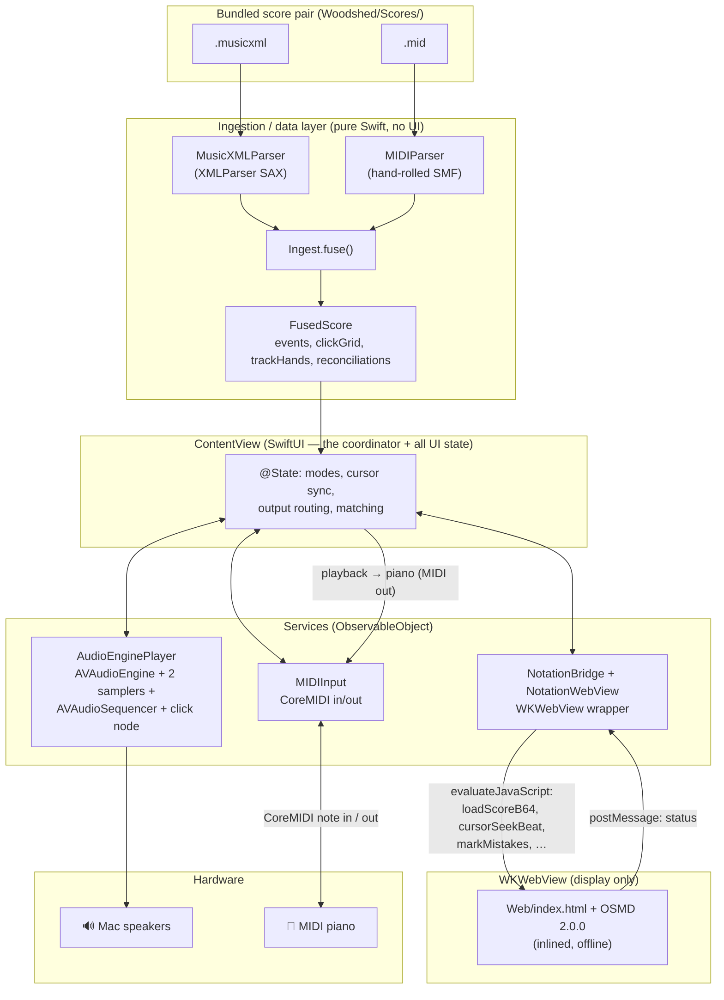

# Architecture — Woodshed

How the app is put together, derived from the current source under `Woodshed/`.

## High-level shape

One SwiftUI multiplatform app. A **pure-Swift ingestion/data layer** turns a MusicXML+MIDI pair into
an authoritative note model; three **ObservableObject services** own audio, MIDI, and the notation
web view; and a single **SwiftUI view** wires them together and holds all UI/practice state.

## Layers & responsibilities

### 1. Data model (`Model.swift`)
Value types only, no logic beyond small helpers. The vocabulary shared by every layer. See
[DATA_MODEL.md](DATA_MODEL.md). Key output type is **`FusedScore`** (the authoritative model).

### 2. Ingestion (pure Swift, UI-independent, unit-testable)
- **`MIDIParser.swift`** — dependency-free Standard MIDI File parser. **MIDI is the timing source of
  truth**: it resolves the tempo map to seconds and exposes tick-based beats. Produces `MidiScore`.
- **`MusicXMLParser.swift`** — `XMLParser` (SAX) parser. **MusicXML is the identity/notation source**
  (spelling, hand/staff, voice, ties, ornaments, per-measure meter). Produces `MusicXMLScore`.
- **`Ingest.swift`** — `Ingest.fuse(midiData:musicXMLData:)` fuses the two: merges tied notes,
  aligns per hand by musical beat, absorbs ornament realisations, builds the metronome click grid
  and per-hand track mapping, and produces per-hand `Reconciliation`. Returns `FusedScore`.
  The rules here are the app's hard core — see [INGESTION.md](INGESTION.md).

### 3. Services (`ObservableObject`, injected as `@StateObject` into `ContentView`)
- **`AudioEnginePlayer.swift`** — owns one `AVAudioEngine`. Graph: `samplerRH` + `samplerLH`
  (`AVAudioUnitSampler`, one per hand) → `mainMixerNode`; a separate `clickNode`
  (`AVAudioPlayerNode`) → `mainMixerNode` for the metronome. An `AVAudioSequencer` plays the actual
  `.mid`, routing each track to its hand's sampler (`destinationAudioUnit`). Responsibilities:
  play/stop, count-in, **tempo via `sequencer.rate`** (pitch preserved), **per-hand + speaker mute
  via each sampler's `volume`/`overallGain`**, and a three-tier metronome (synced to playback,
  free-running, or count-in) that can also route clicks to the piano via a `pianoClick` callback.
  Publishes `isPlaying`, `isRunning`, `metronomeOn`, `status`.
- **`MIDIInput.swift`** — owns a CoreMIDI client. Input port (modern `MIDIEventList`/UMP) connects
  all sources and auto-reconnects on hot-plug; publishes `activeNotes` (held pitches), `status`,
  `sources`. Output port (`MIDIPacketList`) sends playback notes and metronome clicks (GM percussion
  on ch. 10) to the piano.
- **`NotationWebView.swift`** — `NSViewRepresentable`/`UIViewRepresentable` wrapping `WKWebView`.
  Contains **`NotationBridge`** (`ObservableObject`) which holds a weak reference to the web view and
  drives it directly (bypassing SwiftUI churn) at the ~50 Hz cursor rate. Loads `Web/index.html`
  with the OSMD script inlined.

### 4. Library (`Song.swift`, `SongLibrary.swift`, `ContentView.swift`)
- **`Song` / `SongMeta`** — a library song and its Codable metadata (see DATA_MODEL.md).
- **`SongLibrary`** (`ObservableObject`) — the file-based library under Application Support: scan,
  import (2 files → a per-song folder), delete, update; seeds the bundled fixtures on first launch.
- **`ContentView`** — app root: a `NavigationStack` hosting **`LibraryView`** (the song list, with
  add via `.fileImporter`, delete, rename, favourite). Selecting a song navigates to `PracticeView`.

### 5. Practice UI (`PracticeView.swift`, `PianoKeyboardView.swift`)
- **`PracticeView(song:)`** — the practice screen **and** the de-facto coordinator/view-model. Holds
  ~30 `@State` values plus the three `@StateObject` services. It loads the song's XML+MIDI on appear
  (`Ingest.fuse`), drives the follow-cursor from the audio clock (a `Timer.publish` at 0.02 s), routes
  output, implements **Wait mode** and **Tempo/Grade mode** matching, section practice, and marks.
- **`PianoKeyboardView.swift`** — a stateless 88-key keyboard view. Colours: green = you playing,
  blue = right-hand score / red = left-hand score, red = "wrong" when `flagWrong` (Wait/Grade).
  Mouse/touch-playable for testing.

### 5. Notation web surface (`Web/index.html` + vendored OSMD)
Display only — "no logic, no clock in the web layer." Renders the MusicXML and moves a cursor on
command. See the JS bridge contract below.

## Data flow (a practice session)

1. `ContentView.ingest()` loads the bundled `.musicxml` + `.mid`, calls `Ingest.fuse()` → `FusedScore`,
   and hands the raw MusicXML (base64) to the web view for rendering.
2. `FusedScore.events` (`[NoteEvent]`) drives everything: each event carries **MIDI timing**
   (`onsetSeconds`) + **notated identity** (`notatedBeat`, `spelledName`, `hand`, …).
3. On **Play**, `AudioEnginePlayer`'s `AVAudioSequencer` plays the `.mid`; a 0.02 s timer reads
   `sequencer.currentPositionInSeconds` (musical time) and:
   - moves the OSMD cursor via `bridge.seek(continuousBeat(at:t))` (interpolated notated beat),
   - lights the sounding notes on the keyboard,
   - optionally sends the notes to the piano (MIDI out).
4. Live keys arrive as `MIDIInput.activeNotes`; `ContentView.onChange(activeNotes)` feeds the
   **matcher** for the active practice mode.

## Practice modes (state machine, all in `ContentView`)

- **Playback** — audio + cursor, no grading.
- **Wait mode** — `waitSteps` (one per notated beat with notes, per selected hands). The cursor parks
  on a step; `handleWaitInput` accumulates note-ons and advances when the required set is played
  (extras/wrong ignored, shown red). Fumbled steps are recorded and marked red for review on exit.
- **Tempo/Grade mode** — plays at tempo; records `(pitch, time)` for each key you press against the
  playback clock. On stop, `gradePass()` runs a **windowed greedy matcher** (each expected note ↔
  nearest same-pitch played note within `gradeTolerance = 0.30 s` musical): tallies hit / missed /
  wrong + mean timing error, and marks missed notes red. Live keyboard shows the tolerance window.

Wait and Grade are mutually exclusive.

**Section practice** overlays all modes: a bar range (`sectionStart`/`sectionEnd`) maps via
`FusedScore.measureStartBeats` + `secondsAtBeat` to a time range. `AudioEnginePlayer.startSeconds` sets
where playback begins; the cursor tick loops back (`loopBackToStart`, which clears hanging sampler
notes with CC 123 and re-syncs the metronome) when `loopSection` is on, else stops. Wait/Grade only
consider events inside the section (`inSection(beat)`). Grade mode matches in **real time**: `handleGradeNoteOn` matches each key you play to the nearest
expected note (same pitch, within `gradeTolerance`); `advanceGradeMisses` rings a note the moment its
window closes unmatched (progressive misses via the cheap `markMissed` overlay — no OSMD re-render).
With **Loop on**, each pass is tallied into `gradeHistory` and the rings wipe at loop restart, giving a
per-pass accuracy trend for mastery drilling.

## The WKWebView JS bridge

`ContentView`/`NotationBridge` → JS (`webView.evaluateJavaScript`). This is the **contract**;
changing either side requires changing both (`NotationWebView.swift` ↔ `Web/index.html`).

| JS function | Called for |
|-------------|-----------|
| `window.loadScoreB64(b64)` | Render a score (base64 UTF-8 MusicXML) |
| `window.cursorSeekBeat(beat)` | Smoothly move cursor to a fractional notated beat + follow-scroll |
| `window.cursorReset()` / `cursorNext()` | Reset / step cursor |
| `window.setHandColorMode(on, rhHex, lhHex)` | Colour noteheads by hand |
| `window.setMeasuresPerSystem(n)` | Fix N bars per line (0 = auto) |
| `window.markMistakes(pairs)` / `clearMistakes()` | Mark/clear review noteheads red `[[beat,midi],…]` |
| `window.setSelection(startBar, endBar)` / `clearSelection()` | Draw/clear the section highlight (bars, 1-based) |
| `window.markMissed(pairs)` / `clearMissed()` | Ring missed notes via a cheap overlay (no re-render) — updated every practice pass |

JS → Swift also posts `select:startBar:endBar` when the user drags a bar selection on the score
(routed by `NotationBridge.post` to `onSelect`). Bar pixel rects are computed from OSMD measure
bounding boxes (`AbsolutePosition × 10 × zoom`) after each render.

JS → Swift: `window.webkit.messageHandlers.osmd.postMessage(status)` → `NotationBridge.post` →
`@Published status`. The bridge builds anchor tables (beat→pixel) after each render so the cursor
can interpolate horizontally and snap at line breaks; follow-scroll uses a **CSS transform** on the
container (not `window.scrollTo`, which no-ops in the clipped WKWebView).

## State management approach

Pragmatic SwiftUI, **not** a formal pattern (no MVVM view-models per screen, no TCA, no DI
container). `ContentView` is a single large view holding all state; services are `ObservableObject`s
created as `@StateObject` and passed by reference. High-frequency cursor updates deliberately bypass
`@Published` (via `NotationBridge`'s direct `evaluateJavaScript`) to avoid 50 Hz view invalidation.
This is appropriate for a Phase-0 spike but is the main architectural debt (see Open Questions).

## Persistence & networking

- **Persistence: none.** Scores are bundled resources; nothing is written to disk (a temporary
  diagnostic log path exists only behind a dev flag, currently unused). The PRD's SQLite/GRDB layer
  is not built.
- **Networking: none, by design.** No runtime network calls anywhere. OSMD, fonts, sounds, and
  scores are all local.

## Dependency boundaries

- Ingestion layer (`Model`, `MIDIParser`, `MusicXMLParser`, `Ingest`) imports only `Foundation` — no
  SwiftUI/AVFoundation/WebKit. It is independently compilable and testable (this is exercised via
  headless `swiftc` harnesses during development).
- Services each wrap exactly one system framework (AVFoundation / CoreMIDI / WebKit) and expose a
  small Swift surface.
- `ContentView` is the only place that knows about all of them.

## Open Questions

- **`ContentView` is a ~630-line monolith** holding all state and all practice-mode logic. Extract
  view-models (e.g. a `PracticeSession`/matching engine, a `PlaybackController`) before Phase 1
  feature growth. The PRD explicitly wants the matching engine "UI-decoupled, testable."
- **No automated tests** wired into the project (`WoodshedTests`/`WoodshedUITests` are template
  stubs). The pure ingestion layer is the obvious first target for real tests.
- **Threading/concurrency:** CoreMIDI callbacks and the metronome `DispatchSourceTimer` hop to main;
  Swift 6 strict concurrency is not adopted. Revisit when moving off Swift 5 language mode.
- **Matching engine location:** Wait/Grade logic lives in the view. Per PRD §9 it should be a
  standalone module consuming expected events + live MIDI.
