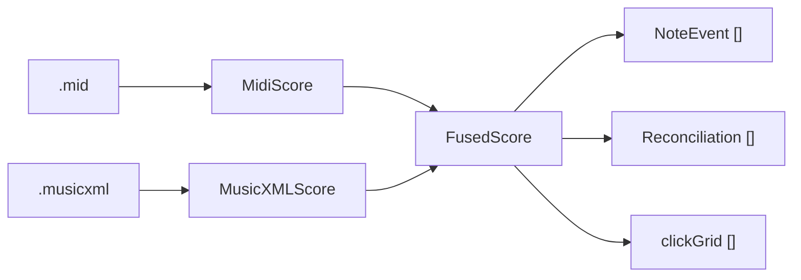

# Data Model — Woodshed

All types are defined in `Woodshed/Model.swift` (plus parser-local structs). They are **in-memory
Swift value types** — there is **no persistent store** yet (see Persistence below).

## Entity overview

## Core types (`Model.swift`)

### `Hand` (enum)
`right` (`"RH"`), `left` (`"LH"`), `unknown` (`"?"`). Derived from MusicXML `<staff>` (1→RH, 2→LH)
and, for MIDI tracks, from an average-pitch heuristic.

### `MidiNote` (from `MIDIParser`)
One sounding MIDI note. Fields: `pitch` (MIDI number), `onsetSeconds`, `durationSeconds` (timing
truth), `onsetBeats` (tick/ticksPerQuarter — tempo-independent, for alignment), `track`, `hand`.

### `MidiScore` (output of `MIDIParser.parse`)
`ticksPerQuarter`, `tempoBPM` (first tempo), `timeSignature`, `notes: [MidiNote]`,
`secondsAtBeat: (Double) -> Double` (tempo-map converter for any beat), `trackHands: [Hand]`
(track→hand for audio routing). Convenience: `rightHandCount`, `leftHandCount`.

### `XMLNote` (from `MusicXMLParser`)
One `<note>`: `pitch?`/`spelledName?` (nil for rests), `isRest`, `isChord`, `staff`, `voice`,
`notatedType`, `dots`, `tieStart`/`tieStop`, `hasOrnament`, `onsetBeats`, `durationBeats`, `measure`.
Computed `hand` from `staff`.

### `MusicXMLScore` (output of `MusicXMLParser.parse`)
`divisions`, `tempoBPM?`, `timeSignature?`, `keyFifths`, `notes: [XMLNote]`, and
`measures: [(startBeat, lengthBeats, num, den)]` (per-measure metric structure, for the metronome).

### `NoteEvent` (the fused, authoritative unit) — `Identifiable`
The thing everything downstream consumes. **MIDI timing fused with MusicXML identity:**
`pitch`, `spelledName`, `hand`, `voice`, `notatedType`, `onsetSeconds`/`durationSeconds` (from MIDI),
`notatedBeat` (from MusicXML — drives the cursor, matches OSMD's own timestamps), `matchedXML`,
`ornamentNotes` (# of realised trill/turn/mordent notes absorbed), computed `isOrnamented`.

### `ClickLevel` (enum)
`downbeat` / `beat` / `sub` — three metronome emphasis tiers.

### `Reconciliation`
Per-hand ingestion audit: `xmlSoundingCount`, `midiCount`, `matched`, `ornamentRealizations`,
`unmatchedMIDI`/`unmatchedXML` (human-readable), computed `isClean`. Proves the two files agree.

### `FusedScore` (the authoritative model) — output of `Ingest.fuse`
- `tempoBPM`, `timeSignature?`, `keyFifths`
- `events: [NoteEvent]` (sorted by onset) — the master list
- `clickGrid: [(time, level: ClickLevel)]` — metronome click times + emphasis, from barlines/meter
- `metronomeBarPattern: [ClickLevel]` + `metronomePulseSeconds` — for count-in & free-run metronome
- `trackHands: [Hand]` — MIDI track → hand, for per-hand audio routing
- `measureStartBeats: [Double]`, `totalBeats: Double`, `secondsAtBeat: (Double) -> Double` — bar
  structure + beat→seconds converter, for **section practice** (bar range → beat range → play/loop
  time range)
- `reconciliations: [Reconciliation]`

### Runtime-only structs (in `ContentView`, not persisted)
- `Mistake { beat, pitch }` — a fumbled/missed position for review marks.
- `GradeResult { accuracy, hits, total, missed, extra, avgMs }` — a Tempo-mode pass score.
- `waitSteps: [(beat, rh: Set<Int>, lh: Set<Int>)]` — Wait-mode step list.

## Relationships & invariants

- One `.musicxml` + one `.mid` → one `FusedScore`. The pair is treated as a unit.
- Ideally **one `NoteEvent` per written note**, carrying MIDI timing. Ornament realisations are
  *absorbed* into their parent event (not first-class), so `events.count` ≈ written-note count, not
  raw MIDI note-on count. See [INGESTION.md](INGESTION.md).
- `notatedBeat` is in quarter-note beats from the start of the piece and is the key that links a
  `NoteEvent` to an OSMD notehead (OSMD `AbsoluteTimestamp × 4`) and to a cursor position.
- `onsetSeconds` is musical time (rate 1.0); it stays comparable to `AVAudioSequencer`'s
  `currentPositionInSeconds`, which is also musical time — so cursor/metronome/grading follow the
  tempo slider automatically.

## Persistence

**None today.** Scores are compiled in as bundle resources (`Woodshed/Scores/`, folder-synced).
There is no Core Data / SwiftData / SQLite store, no user library, no session history.

The PRD (§8, §9) specifies a future **SQLite via GRDB** layer for: the imported library, per-piece
config (target tempo, tolerances, saved clips), session history, per-attempt results, and cached note
events. When built, this doc must gain a schema section and migration notes. Candidate persisted
entities implied by the PRD: `Piece`, `Section/Clip`, `PracticeSession`, `Attempt`, `NoteEventCache`.

## Migration considerations

- Not applicable yet (no store). When GRDB lands, cached note events derived from `FusedScore` should
  be versioned so a change to the ingestion rules can invalidate/rebuild them.
- The imported score files themselves are the durable input; the derived model can always be rebuilt
  by re-running `Ingest.fuse`.

## Open Questions

- **Persistence not started.** Confirm GRDB/SQLite (PRD) vs SwiftData before building the store —
  SwiftData would be more idiomatic for a new multiplatform app but the PRD deliberately chose GRDB
  for "direct SQL, transparent." This is a live decision (see DECISIONS.md ADR-013).
- Should `FusedScore`/`NoteEvent` be cached to disk, or always recomputed on load? (Ingestion is
  fast; caching may be premature.)
- Voice handling is captured (`voice`) but not yet used downstream — confirm it's needed for the
  matcher/rhythm tools before relying on it.
