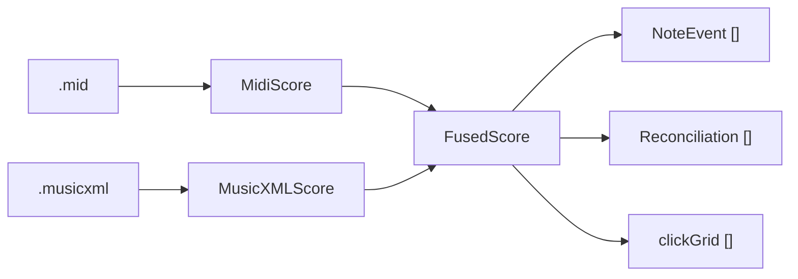

# Data Model — Woodshed

All types are defined in `Woodshed/Model.swift` (plus parser-local structs). They are **in-memory
Swift value types** — there is **no persistent store** yet (see Persistence below).

## Entity overview



## Core types (`Model.swift`)

### `Hand` (enum)
`right` (`"RH"`), `left` (`"LH"`), `unknown` (`"?"`). Derived from MusicXML `<staff>` (1→RH, 2→LH)
and, for MIDI tracks, from an average-pitch heuristic.

### `MidiNote` (from `MIDIParser`)
One sounding MIDI note. Fields: `pitch` (MIDI number), `onsetSeconds`, `durationSeconds` (timing
truth), `onsetBeats` (tick/ticksPerQuarter — tempo-independent, for alignment), `track`, `hand`.

### `MidiScore` (output of `MIDIParser.parse`)
`ticksPerQuarter`, `tempoBPM` (first tempo), `timeSignature`, `notes: [MidiNote]`,
`secondsAtBeat: (Double) -> Double` (tempo-map converter for any beat), `trackHands: [Hand]`
(track→hand for audio routing). Convenience: `rightHandCount`, `leftHandCount`.

### `XMLNote` (from `MusicXMLParser`)
One `<note>`: `pitch?`/`spelledName?` (nil for rests), `isRest`, `isChord`, `staff`, `voice`,
`notatedType`, `dots`, `tieStart`/`tieStop`, `hasOrnament`, `onsetBeats`, `durationBeats`, `measure`.
Computed `hand` from `staff`.

### `MusicXMLScore` (output of `MusicXMLParser.parse`)
`divisions`, `tempoBPM?`, `timeSignature?`, `keyFifths`, `notes: [XMLNote]`, and
`measures: [(startBeat, lengthBeats, num, den)]` (per-measure metric structure, for the metronome).

### `NoteEvent` (the fused, authoritative unit) — `Identifiable`
The thing everything downstream consumes. **MIDI timing fused with MusicXML identity:**
`pitch`, `spelledName`, `hand`, `voice`, `notatedType`, `onsetSeconds`/`durationSeconds` (from MIDI),
`notatedBeat` (from MusicXML — drives the cursor, matches OSMD's own timestamps), `matchedXML`,
`ornamentNotes` (# of realised trill/turn/mordent notes absorbed), computed `isOrnamented`.

### `ClickLevel` (enum)
`downbeat` / `beat` / `sub` — three metronome emphasis tiers.

### `Reconciliation`
Per-hand ingestion audit: `xmlSoundingCount`, `midiCount`, `matched`, `ornamentRealizations`,
`unmatchedMIDI`/`unmatchedXML` (human-readable), computed `isClean`. Proves the two files agree.

### `FusedScore` (the authoritative model) — output of `Ingest.fuse`
- `tempoBPM`, `timeSignature?`, `keyFifths`
- `events: [NoteEvent]` (sorted by onset) — the master list
- `clickGrid: [(time, level: ClickLevel)]` — metronome click times + emphasis, from barlines/meter
- `metronomeBarPattern: [ClickLevel]` + `metronomePulseSeconds` — for count-in & free-run metronome
- `trackHands: [Hand]` — MIDI track → hand, for per-hand audio routing
- `measureStartBeats: [Double]`, `totalBeats: Double`, `secondsAtBeat: (Double) -> Double` — bar
  structure + beat→seconds converter, for **section practice** (bar range → beat range → play/loop
  time range)
- `reconciliations: [Reconciliation]`

### Runtime-only structs (in `PracticeSession`, not persisted)
- `Mistake { beat, pitch }` — a fumbled/missed position for review marks.
- `GradeResult { accuracy, hits, total, missed, extra, avgMs }` — an in-session Tempo-mode pass score
  (drives the live status line + trend; the persisted equivalent is `PracticePass`).
- `waitSteps: [(beat, rh: Set<Int>, lh: Set<Int>)]` — Wait-mode step list.

### `PracticePass` (persisted practice record) — `Codable, Identifiable` (`PracticeHistory.swift`)
One tallied Grade pass, appended to the song's `history.jsonl`. Fields: `id`, `date`, `mode`
(`"grade"`), `sectionStart`/`sectionEnd`/`measureCount` (the bar range + whole-piece size),
`tempoPct`, `handMode`, `total`/`hits`/`missed`/`wrong`/`avgMs`, and `missedBars: [Int]` (one 1-based
bar per missed note — weights the trouble-spot heatmap). Computed `accuracy`, `isFullPiece`.
`TroubleBar { bar, misses }` is the aggregate of `missedBars` across passes.

## Relationships & invariants

- One `.musicxml` + one `.mid` → one `FusedScore`. The pair is treated as a unit.
- Ideally **one `NoteEvent` per written note**, carrying MIDI timing. Ornament realisations are
  *absorbed* into their parent event (not first-class), so `events.count` ≈ written-note count, not
  raw MIDI note-on count. See [INGESTION.md](INGESTION.md).
- `notatedBeat` is in quarter-note beats from the start of the piece and is the key that links a
  `NoteEvent` to an OSMD notehead (OSMD `AbsoluteTimestamp × 4`) and to a cursor position.
- `onsetSeconds` is musical time (rate 1.0); it stays comparable to `AVAudioSequencer`'s
  `currentPositionInSeconds`, which is also musical time — so cursor/metronome/grading follow the
  tempo slider automatically.

## Persistence — file-based song library

The library is stored on disk as **self-contained per-song folders** (no database). See
`Song.swift` / `SongLibrary.swift` and DECISIONS.md ADR-018.

```
~/Library/Application Support/Segno/Scores/
    <uuid>/
        score.musicxml     # the imported MusicXML
        score.mid          # the imported MIDI
        metadata.json      # SongMeta (Codable)
        history.jsonl      # one PracticePass per line (append-only; created on first pass)
        flags.json         # [BarFlag] — manual revisit notes (rewritten on change)
        sections.json      # [SavedSection] — named practice sections
        time.json          # {"YYYY-MM-DD": seconds} — active practice time per day
        takes.json         # {"start-end": Take} — best graded take per section
        report.json        # PassReport — the most recent pass's report card (survives relaunch)
```

- **`SongMeta`** (Codable, persisted as `metadata.json`): `id: UUID`, `title`, `composer?`,
  `dateAdded`, `favourite`, `targetTempoPct?`, `lastPracticed?`, `bestAccuracy?` (best full-piece
  Grade accuracy, for the library row), `barsPerLine?` (remembered measures-per-system; nil/0 = auto),
  `category?` (`SongCategory` = repertoire | technical; nil = repertoire — groups the library sidebar).
  The single place song-specific state lives; travels with the folder. Derived stats (`lastPracticed`,
  `bestAccuracy`) are denormalised here so the library list needn't read every `history.jsonl`.
  **New fields are `Optional`** so older `metadata.json` (written before the field) still decodes
  (synthesized `Decodable` ignores non-optional defaults for missing keys).
- **`Song`** (`Identifiable`, `Hashable`): `meta` + `folder` URL; derives `musicXMLURL`, `midiURL`,
  `metadataURL`.
- **`SongLibrary`** (`ObservableObject`): scans `Scores/` into `songs: [Song]` (sorted by title);
  `importSong(musicXML:midi:title:)` copies a pair into a new `<uuid>` folder; `delete`, `update`
  (rewrite metadata); `recordPass(_:for:)` appends a `PracticePass` to `history.jsonl` and updates the
  song's denormalised stats in place. On first launch (empty library) it seeds the two bundled fixtures.
- **`BarFlag`** (Codable, `bar` + `note` + `date`; one per bar) / **`BarFlagStore`** (enum, pure file
  IO: `load`/`save` the per-song `flags.json` array). Manual "revisit" notes pinned to bars — a small
  mutable set rewritten on change (unlike the append-only history). The session mirrors them in memory
  for the Flags sheet + the on-score ⚑ markers.
- **`PracticeHistory`** (enum, pure file IO): `append` / `load` the JSON-lines history; `troubleBars`
  (all-time miss counts) and `currentTroubleBars` (**still-outstanding** — a bar counts only while the
  most recent covering pass still missed it, so it clears once played clean). `SongLibrary.recordPass`
  / `resetProgress` are the write/erase paths; the session mirrors history in memory for the Progress
  view + the on-score trouble overlay.

Now persisted: **per-pass Grade history** (`history.jsonl`) + the denormalised `lastPracticed` /
`bestAccuracy`. Not yet: Wait-mode records, per-piece config beyond `targetTempoPct`, and **cross-song**
analytics — that last one is the point at which a DB (GRDB) may replace the per-song scan.

The `FusedScore`/`NoteEvent` model is **not** persisted — it's recomputed from the song's XML+MIDI by
`Ingest.fuse` each time a song is opened.

### App-wide preferences (`AppSettings`, UserDefaults)
Global "how I like the app to behave" settings live in `UserDefaults` under `pref.` keys (`AppSettings.swift`),
**not** in any song folder — they apply everywhere and persist across launches: view toggles (cursor
smooth, colour hands, highlight notes, trouble spots, keyboard), output routing, metronome
start/stop behaviour, count-in, start-on-first-note, grading tolerance, and speed-trainer config.
`PracticeSession` reads them at init and writes back on change (`keyboardVisible` via `@AppStorage`).
Per-*practice* context (tempo, hand, section/loop, running drill) is intentionally **not** persisted.
See ADR-036 for the three-tier split (global pref / per-song meta / transient context).

## Migration considerations

- Not applicable yet (no store). When GRDB lands, cached note events derived from `FusedScore` should
  be versioned so a change to the ingestion rules can invalidate/rebuild them.
- The imported score files themselves are the durable input; the derived model can always be rebuilt
  by re-running `Ingest.fuse`.

## Open Questions

- **Persistence is file-based, not a DB.** Per-song `history.jsonl` + `metadata.json` now cover
  per-piece progress. A store (GRDB vs SwiftData) is only needed once **cross-song** analytics (a
  library-wide heatmap, spaced repetition across pieces) arrive — deferred until then (ADR-021, and
  ADR-013 for the GRDB-vs-SwiftData call when it comes).
- Should `FusedScore`/`NoteEvent` be cached to disk, or always recomputed on load? (Ingestion is
  fast; caching may be premature.)
- Voice handling is captured (`voice`) but not yet used downstream — confirm it's needed for the
  matcher/rhythm tools before relying on it.
