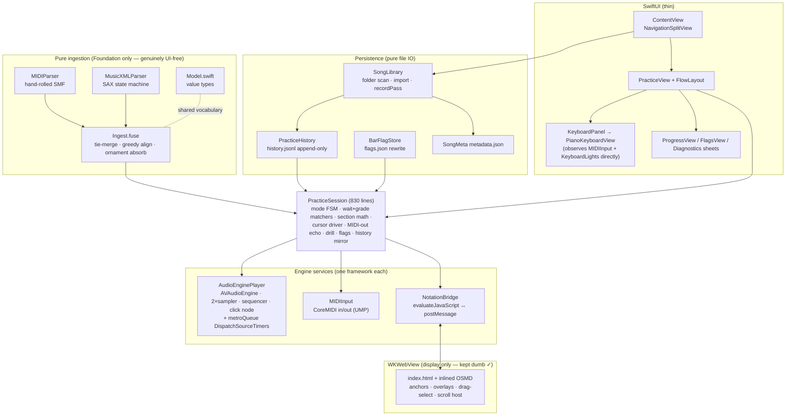

# Architecture as built

Audited at commit `219a390` + uncommitted working tree. ~4,000 lines Swift (16 files) + 503-line JS
notation page + vendored OSMD 2.0.0 (1.26 MB). No third-party Swift dependencies. This describes
what the code *actually does*, verified by reading it.

## Component map (real dependencies)

The intended layering **largely holds**: `Model`/`MIDIParser`/`MusicXMLParser`/`Ingest` import only
Foundation (verified); each engine wraps exactly one system framework; the web layer contains no
clock or business decisions. The deviation from intent is concentration, not leakage:
`PracticeSession.swift` (830 lines) owns seven concerns — mode state machine, both matchers,
section math, the cursor/tick driver, MIDI-out echoing, the speed-trainer drill, and flags/history
mirroring — making it the file every future feature must touch (see ARCH-03).

## Data flow (a practice session)

1. **Import** — `LibraryView.handleImport` (ContentView.swift:143-153) copies an XML+MIDI pair into
   `Application Support/Woodshed/Scores/<uuid>/`; `metadata.json` written (SongLibrary.swift:49-61).
2. **Open** — `PracticeView.onAppear` → `PracticeSession.onAppear()` → `ingest()`
   (PracticeSession.swift:790-821): reads both files, `Ingest.fuse` → `FusedScore`, base64 XML → OSMD,
   `.mid` → `AVAudioSequencer`, click grid → metronome. **Synchronous on the main thread.**
3. **Playback** — sequencer plays the actual `.mid` (tempo via `.rate`, per-hand samplers).
4. **Tick** — a 50 Hz `Timer.publish` in the *view* (PracticeView.swift:39,63) calls
   `advanceCursorWithPlayback()` (PracticeSession.swift:679-764), which: checks the loop boundary,
   seeks the OSMD cursor (`evaluateJavaScript` per tick), closes grade windows, computes keyboard
   highlight, and diffs MIDI-out echo notes.
5. **Input** — CoreMIDI callback → main queue → `midi.$activeNotes` Combine sink →
   `midiNotesChanged` → Wait/Grade matchers (PracticeSession.swift:236-244, 619-628).
6. **Analytics** — pass completion → `finalizeGradePass` → `PracticePass` appended to
   `history.jsonl` + denormalised stats into `metadata.json` (PracticeSession.swift:408-427;
   SongLibrary.swift:88-97).

## The clock model

There is **one authoritative musical clock**: `AVAudioSequencer.currentPositionInSeconds`
(AudioEnginePlayer.swift:313), which runs in *musical* time (tempo-map-aware, scales with `.rate`).
Cursor, grading windows, keyboard highlight, MIDI-out echo, and the *synced* metronome all derive
from it — this is the right design and it's consistently applied.

Two deliberate exceptions run on wall-clock `DispatchSourceTimer`s while the sequencer is stopped:
the **free-run metronome** and the **count-ins** (AudioEnginePlayer.swift:154-218). During a
count-in `isRunning == false` gates the tick so nothing else consumes time (PracticeSession.swift:689).
The handoff points (count-in → `reallyStart`/`resumeAfterLoopCountIn`) anchor the metronome resync
to the intended `startSeconds` rather than the latency-nudged clock (AudioEnginePlayer.swift:340,
376) — a correct fix for a real class of drift.

**Weaknesses in the clock chain:** (a) consumption is *polling* at 50 Hz from a main-thread view
timer, so every consumer inherits main-thread jank — see ARCH-01; (b) the metronome fires clicks
from a 4 ms polling timer with `scheduleBuffer(at: nil)` (AudioEnginePlayer.swift:137-151, 238), so
click timing carries timer + render-queue jitter rather than being sample-accurately scheduled
(PRD's stated target); (c) `nextClick` is written by main (`startSynced`) and metroQueue (handler)
without synchronisation — a benign-in-practice data race Swift 6 would reject.

## State management

Lightweight MVVM. `PracticeSession` re-broadcasts `audio` + `bridge` `objectWillChange` but
deliberately **not** `midi` (PracticeSession.swift:233-244), and the high-churn keyboard highlight
lives in a separate `KeyboardLights` object (16-28) so 50 Hz updates repaint only `KeyboardPanel`
(PracticeView.swift:414-438). High-frequency cursor motion bypasses SwiftUI entirely via
`bridge.seek` → `evaluateJavaScript`. These are the right instincts. Remaining issues: the session
is not `@MainActor` (correctness currently rests on convention), `KeyboardPanel` still observes the
whole session for three booleans (PracticeView.swift:415, 421), and `PianoKeyboardView` rebuilds
~140 diffed views per change (see ARCH-02).

## Persistence

Per-song folder = `score.musicxml` + `score.mid` + `metadata.json` + `history.jsonl` + `flags.json`.
Append-only JSONL for history (partial line on crash = one skipped record — good). Two durability
gaps: metadata/flags writes are **non-atomic** (`Data.write(to:)` with no `.atomic`,
SongLibrary.swift:121, BarFlag.swift:38) and the library scan **silently skips** any folder whose
metadata fails to decode (SongLibrary.swift:38-41) — so a kill mid-write can make a song vanish
from the list while its files sit intact on disk (QUAL-03). Schema migration is handled the cheap,
correct way: new `SongMeta` fields are `Optional` (Song.swift:20-24).

## The WKWebView bridge

Contract is small and one-way-ish: Swift → JS via 13 `evaluateJavaScript` entry points
(NotationWebView.swift:51-105), JS → Swift via a single string `postMessage` channel multiplexing
`status` / `select:` / `flag:` (NotationBridge.post, 35-48). Message volume is dominated by
`seek()` at 50 Hz during playback — each call is a cross-process IPC with a string parse. The page
holds no state Swift depends on except the anchors table (rebuilt on every render/resize —
index.html:99-104, 440). The web layer is genuinely dumb. Gap: if the web content process dies the
app posts an error and never recovers (NotationWebView.swift:223-225).

## Highest-risk couplings

1. **`advanceCursorWithPlayback` is the load-bearing wall** (PracticeSession.swift:679-764): loop
   control + drill stop + cursor + grading + highlight + MIDI echo in one 50 Hz function. Nearly
   every recent regression (double-recorded passes, loop blips, early-cut notes) was an interaction
   *inside this function*. Any future feature touching time flows through here.
2. **`notatedBeat` as the universal join key.** OSMD cursor anchors, grade marks, trouble bars,
   wait steps, and section math all assume XML beats ≡ OSMD timestamps ≡ (via `secondsAtBeat`) MIDI
   time. That holds only while scores are repeat-free and single-part — when it breaks (MUSIC-01,
   MUSIC-04) *every* downstream feature breaks at once, silently.
3. **`PracticeSession` fan-out**: 830 lines, 25+ `@Published`/state fields, every feature added in
   the last week landed here. It works, but each addition raises the interaction-bug surface (the
   speed trainer alone touched play-start, loop boundary, section change, and pass finalize).
